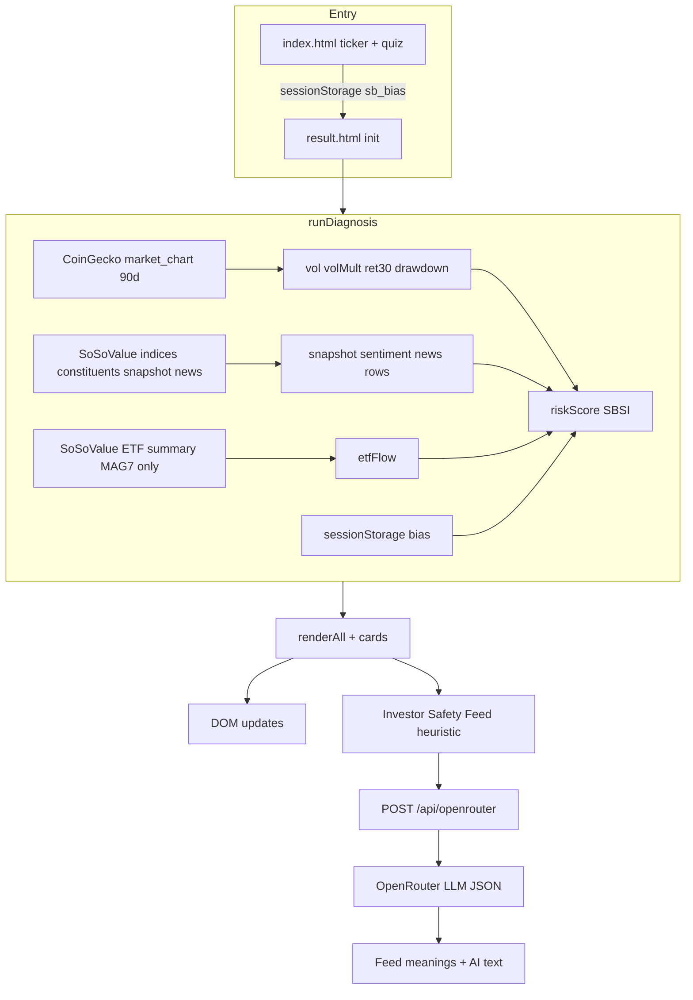

# Judge-facing: Dynamic UI ↔ Data lineage (Wave 1)

This document maps **what moves on screen** to **where the data comes from** and **which code owns it**, so reviewers can verify the product is data-grounded—not static copy.

**Primary implementation:** single-page [`result.html`](../result.html) (vanilla JS).  
**Proxies:** [`api/coingecko.js`](../api/coingecko.js), [`api/sosovalue.js`](../api/sosovalue.js), [`api/openrouter.js`](../api/openrouter.js).  
**Entry funnel:** [`index.html`](../index.html) → `result.html?ticker=…` (+ optional bias in `sessionStorage`).

---

## End-to-end flow (high level)

---

## `index.html` (pre–result page)

| User sees | Logic | Storage / navigation |
|-----------|--------|----------------------|
| SSI cards, manual ticker | Static UI + JS validation | `Continue` builds `result.html?ticker=…` |
| 3 bias questions (optional) | Answers scored → adjustment + tags | `sessionStorage` key `sb_bias`; read in `loadBias()` in `result.html` |

---

## `result.html` — loading / pipeline log

| User sees | Data | Source | State / code |
|-----------|------|--------|--------------|
| “Calculating…” steps with ✓/⚠/✗ and ms | Per-step status from each `await` | CoinGecko + SoSoValue calls | `agentLogLine` / `startAgentStep` inside `runDiagnosis()` |
| Live pill (top) | `liveCount` vs `totalCount` | Same | `renderAll()` — compares completed live steps to expected total |

---

## `result.html` — after `runDiagnosis()` + `renderAll()`

| UI block | What the user sees | Primary inputs | How it is computed / fetched | Key `state` fields | Render / logic |
|----------|---------------------|----------------|-----------------------------|-------------------|----------------|
| **Ticker badge / CTA label** | Selected ticker | URL query | `URLSearchParams` | `state.ticker` | `init()` |
| **Live data pill** | “Live data” / “Partial live (n/m)” / “Estimate…” | Step counters | `liveCount` incremented when a proxied call succeeds; `totalCount` = expected steps | `liveCount`, `totalCount` | `renderAll()` |
| **Quick Decision** | Action title, sizing lines, “Why”, confidence | Volatility, bias, live ratio | `getActionGuidance()` + rules on `riskScore`; data quality from `liveCount/totalCount` | `riskScore`, `volMult`, `bias`, `liveCount`, `totalCount` | `renderQuickDecision()` |
| **7-tier signal** | Color, label, subline, score /100 | Annualized vol vs S&P baseline (~13.5%) + bias | `volMult` from CoinGecko prices or SSI fallback constants; `riskScore = clamp(volMult→score + bias)` | `volMult`, `riskScore`, `bias` | `renderAll()` + `TIERS` |
| **SBSI card** | 0–100 + prose | Risk inverse + small nudges | `sbsi ≈ 100 - riskScore` ± ETF flow ± 24h snapshot | `sbsi`, `etfFlow`, `snapshotSentiment` | `runDiagnosis()` then `describeSbsi()` in `renderAll()` |
| **S&P500 comparison** | Bars, “How to read”, ±1% / -5% scenarios | `volMult`, ticker name | Linear scaling from `volMult`; static benchmark copy in HTML | `volMult`, `state.ticker` | `renderAll()` |
| **SoSoValue · Live Index** | Index id, $ price, 24h %, news total, attention, constituents | SoSoValue snapshot + news list + constituents | Hidden for non-`.ssi`; price from snapshot; momentum from `pick24hChange`; news count from API `total`; attention heuristic on list | `ssiIndexTicker`, `indexSnapshot`, `newsTotal`, `newsAttention`, `constituents` | `renderSosoIndexCard()` |
| **Investor Safety Feed** | 5 rows: tag, title link, “meaning” line | SoSoValue `news` list (top 5) | Rows: `normalizeNewsRow` (title from `content` if `title` null; URL from `source_link`); first paint uses `heuristicTag`; then LLM | `newsRows`, `newsAnnotations` | `renderInvestorSafetyFeed()`; async `fetchAi()` merges OpenRouter `news` |
| **Detailed Analysis tiles** | Vol %, 30d return, max DD, ETF tile | CoinGecko stats + SoSoValue ETF (MAG7 only) | See cells | `vol`, `ret30`, `drawdown`, `etfFlow` | `renderAll()` |
| **Layer scorecard L2–L4** | Safety / Action / Backtest badges | Live ratio; risk band; 90d stats | L2 from `liveCount/totalCount`; L3 from `getActionGuidance()`; L4 from `getBacktestProxy()` | same + `ret30`, `drawdown` | `renderLayerScorecard()` |
| **Diagnosis Transparency** | Ticker, index id, price source, bias +, fetched time, API status | Session + diagnosis | Mirrors `state` for audit | many | `renderAll()` bottom block |
| **AI Recommendation** | Paragraph + `[#N]` links | All of the above + news titles | `fetchAi()` POST body; OpenRouter returns `recommendation`; on failure `templateAdvice()` | uses `state` snapshot | `fetchAi()` |
| **Bias note** (yellow) | “Your behavioral profile … +N” | Quiz | Only if `bias.adjustment > 0` | `bias` | `renderAll()` |

---

## Server: what each API adds

| Route | Role in UI |
|-------|------------|
| `GET /api/coingecko?…market_chart…` | 90-day closes → annualized vol, 30d return, max drawdown → drives risk tier, scenarios, L4 proxy |
| `GET /api/sosovalue?endpoint=indices` | Resolve display ticker → SoSoValue index id (`ssiMAG7` etc.) |
| `GET /api/sosovalue?…/constituents` | Basket weights; top row sets **news filter** `currency_id` |
| `GET /api/sosovalue?…/market-snapshot` | Index USD price + 24h change → SBSI nudge + SoSoValue card momentum |
| `GET /api/sosovalue?endpoint=news&…` | Top 5 rows + `total` + attention heuristic |
| `GET /api/sosovalue?…etfs/summary-history` | **MAG7.ssi only:** US ETF net flow cue for SBSI + detail tile |
| `POST /api/openrouter` | JSON `recommendation` + per-row `news[]` (meanings); server **merges heuristics** if the model omits rows |

---

## Fallback philosophy (one sentence for demos)

If a live call fails, the app **still completes**: CoinGecko failure uses **preset volatility multiples** per SSI; SoSoValue partial failures leave tiles at **“—”** or copy explains N/A; OpenRouter failure keeps **`templateAdvice()`** text so the page never dead-ends.

---

## Related docs

- API inventory and Wave scope: [`docs/api_usage_plan.md`](api_usage_plan.md)  
- Product pitch (short): [`docs/submission_about.md`](submission_about.md)  
- README judge path: [`README.md`](../README.md) “For Judges”

---

## Revision history

| Date | Change |
|------|--------|
| 2026-05-12 | Initial matrix for judge / reviewer walkthroughs |
